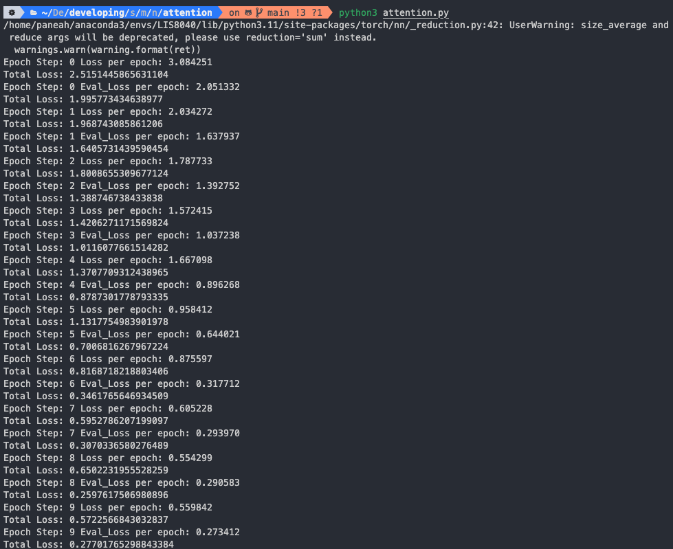

# Attention

V 변수는 상수형태의 word vector vocab의 size이고 sentence의 word 수는 10개로 고정 되어있습니다.  attention encoder layer의 갯수는 N = 2개 이며 model은 Transformer layer로 positional embedding → multihead attention → norm and add → FF → cross attention 모두 구현 되어 있습니다. Optimizer로는 Adam, Loss로는 예측과 실제 값의 분포를 측정하는 KLDiv 함수가 쓰였습니다. 

run_epoch 함수의 가독성과 epoch step이 업데이트 되지 않는 버그를 수정한 후 코드를 실행하였습니다.

```python
def run_epoch(data_iter, model, loss_compute, j):
    "Standard Training and Logging Function"
    total_tokens = 0
    total_loss = 0
    tokens = 0
    for i, batch in enumerate(data_iter):
        out = model.forward(batch.src, batch.trg,
                            batch.src_mask, batch.trg_mask)
        loss = loss_compute(out, batch.trg_y, batch.ntokens)
        total_loss += loss
        total_tokens += batch.ntokens
        tokens += batch.ntokens
        if i % 50 == 1 and model.training:
            print("Epoch Step: %d Loss per epoch: %f" %
                    (j, loss / batch.ntokens))
            tokens = 0
        elif i % 50 == 1 and not model.training:
            print("Epoch Step: %d Eval_Loss per epoch: %f" %
                    (j, loss / batch.ntokens))
            tokens = 0
    print('Total Loss: ' + f'{total_loss / total_tokens}')
```

훈련에는 V = 11, batch_size는 30, 총 20개의 batch가 사용되었습니다. 

평가에는 동일하지만 5개의 batch만 사용 되었습니다. epoch은 총 10번입니다.  



Total loss, Train loss, Eval loss 모두 잘 감소하며 훈련이 잘 진행되었다고 결론 지을 수 있습니다.